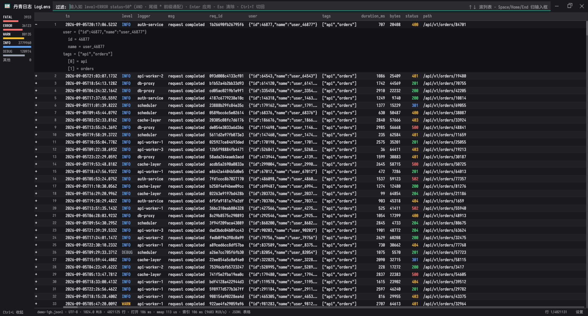

# 丹青日志 LogLens (danqing-log)

[](https://github.com/14uncle/danqing-log/releases/latest)
[](LICENSE-MIT)
[](#下载)

**LogLens** — a fast large-file log & JSONL viewer for Windows, written in Rust.
Opens GB-scale files instantly (1 GiB indexed in 92 ms) with a virtualized scroll
view, tail-follow + live filtering, regex search with highlighting, and a JSONL
column view with nested expand and field filtering. Free & open source (Apache-2.0) —
no account, no telemetry, nothing leaves your machine.

Windows 上的大文件日志 / JSONL 查看分析器 —— 丹青第四件产品。
GB 级文件秒开、虚拟化滚动、tail 跟随 + 实时过滤、正则搜索高亮、JSONL 列化 + 嵌套展开 + 字段过滤。

**v1.0 = 免费层单二进制全功能**，GitHub 永久免费开源。多文件时间戳合并、字段分析、导出、
工作台会话持久化属付费层（$29 个人 / $59 企业买断），见 [`docs/ROADMAP-v1x.md`](docs/ROADMAP-v1x.md)。



## 实测数字

1 GiB 实测（release，本机，`logbench` 无窗口基准；完整报告见
[`PERFORMANCE_REPORT.md`](PERFORMANCE_REPORT.md)）：

| 指标 | 明文日志 | JSONL |
|---|---|---|
| 索引 | 92 ms | 94 ms |
| 搜索 (`ERROR`，默认大小写不敏感) | 115 ms | 129 ms |
| 字段过滤 (`level=ERROR`，`level=error` 同效) | — | 40 ms |
| 随机访问 | 0.52 µs/行 | 0.58 µs/行 |
| 打开（冷 / 热） | ~600 ms / ~90 ms | 同 |

> 2026-09-15 复测（热缓存）。搜索行为 2026-09-15 起**默认大小写不敏感**，
> 比原来的敏感匹配慢约 1.6 倍（短字面 `ERROR`：71 → 115 ms）—— 这是 UI 之外的
> 后台扫描，体感无差；需要精确匹配时在模式里写 `(?-i)`。
> 打开与索引不受影响（不敏感只作用于查询期）。

行索引为**步进表**（`memchr` SIMD 扫 `\n`，每 `INDEX_STRIDE` 行记一个绝对偏移，段内前扫定位），
不是逐行偏移表 —— 1 GB 文件行索引内存 ≤ 16 MB（`SPEC` 验收上界）。

## 和同类工具怎么选

一句话定位：**klogg 的速度 × LogViewPlus 的结构化**。

- **对 klogg**：同为 mmap 架构，速度同档（不声称碾压）。缝在功能与维护 —— klogg 最近一次
  release 是四年多前、commit 停了 22 个月（2026-09-16 查证），无 JSONL 支持。
- **对 LogViewPlus**：功能全，但全量解析 = 打开慢的结构性代价（1 GB 冷启动本机实测约
  60 秒），且是付费商业软件。LogLens 走 mmap + 虚拟视口，结构性快；v1.0 全功能免费。
- **对 VS Code**：能开但慢 —— 1 GB 明文日志本机实测约 10 秒（2026-09-20）；JSONL 列化
  要靠扩展（Daucloud 同文件冷启动实测约 7 秒），还占着编辑器、吃编辑器资源。

> 完整对比表与逐项证据日期见 [PERFORMANCE_REPORT.md](PERFORMANCE_REPORT.md)「竞品对比」
> 与 [DEEP_COMPETITIVE_RESEARCH.md](docs/DEEP_COMPETITIVE_RESEARCH.md)。

## 功能

- **打开**：启动传参 / `Ctrl+O` / 拖到 exe 上；异步索引，1 GB 以上文件全程可响应，
  底栏显示 `{pct}% · {done}/{total} MiB`，索引中可取消或开另一个文件
- **滚动**：行锚定虚拟视口（不建全量行偏移表），2 亿像素域不失真
- **搜索**：正则（`regex::bytes`，全文扫描），可见区高亮 + 命中逐跳导航，上限 100 万条命中；
  **默认大小写不敏感**（`error` 命中 `ERROR`），要精确匹配把模式写成 `(?-i)error`
- **tail 跟随**：250 ms 节流轮询，新行 ≤1 s 出现；上滚自动脱离、`End` 恢复；
  外部截断 / 轮转自动重建（旧内容重建期间保持可见），无增长时空闲 CPU < 1%
- **JSONL 表格**：自动检出（采样前 64 行，非空行中 ≥90% 可解析为 JSON object，不足 3 行不判）
  → 列发现（采样前 512 行，上限 16 列）→ 列化表格；
  嵌套对象以子行展开（行首 ▶/▼ 或 `→`/`←`）；字段过滤迷你语法跑在工作线程，不冻界面；
  字段名与值**均默认大小写不敏感**（`LEVEL=error` 等价于 `level=ERROR`）
- **编码**：UTF-8（含 BOM）/ UTF-16 LE·BE（有无 BOM 均可）/ GBK（原字节索引 + 行级 CP936 解码，
  中文可搜）/ 其余单字节编码 Latin-1 兜底

  
- **级别直方图**：左侧侧栏 6 桶计数（FATAL / ERROR / WARN / INFO / DEBUG / 其他）+ 对数刻度横条
  —— 线性刻度下 Info 454 万会把 Fatal 4760 压成亚像素，而后者才是要抓的那根。
  JSONL 模式下点柱条即筛出该级别（可点的行有 hover 反馈），侧栏底部出现 `清除筛选`
  可退回全部数据；`Ctrl+L` 收起侧栏（完整快捷键见设置卡 ⚙）
- **选区 / 复制**（`Ctrl+C`）：双击选词（时间戳 / IP / `level=ERROR` / 路径 / URL 整选，
  英文按单词断开，中文逐字）；拖动框选字符级、可跨行、可跨展开子行；
  取内容按 **「文本选区 > 单元格 > 行选中」** —— 表格双击单元格拿**完整值**
  （不受列宽截断省略影响），选中行拿整行原文，展开块里选子行拿该子行 `label = value`
- **其它**：级别着色（ERROR/WARN/INFO/DEBUG）、书签（会话内）、
  深浅主题（设置卡切换，即时生效且跨会话持久化，落 `config.toml`）、
  系统托盘（右键：设置 / 退出）、启动无参空态、设置卡含版本检查

## 下载

- **GitHub Releases**（主）：[最新版](https://github.com/14uncle/danqing-log/releases/latest)
  取 `danqing-log-v<版本>-win-x64.zip` —— 不到 5 MB，解压即用，不写注册表
- **Microsoft Store**（辅）：**已提交，认证中（2026-09-19）**，链接过审后补上 —— 商店版
  由商店代管更新。联网行为：**v1.0 零网络请求**；v1.x 起商店版会查询付费层购买授权
  （经 Windows 的商店服务，应用自身不发 HTTP），便携版唯一联网动作仍是启动时查一次
  新版本（见[隐私政策](docs/privacy-policy.md)）
- **付费层（v1.x，收银台在建）**：免费层永久免费不变；付费层是**新增**的批量 / 留存 /
  交付能力（$29 个人 / $59 企业买断，见 [`docs/ROADMAP-v1x.md`](docs/ROADMAP-v1x.md)）。
  便携版 license key 离线校验不联网；购买链接开业后回填此处

> 系统要求：Windows 10 1809+（x64）、DirectX 12 兼容显卡。两个渠道是同一个免费层，功能一致。

## 用法

```bash
# GUI: 打开日志文件 (JSONL 自动检出 → 列化表格)
cargo run --release -- <日志文件路径>

# 无窗口基准 (打开/索引/搜索/过滤/随机访问实测表)
cargo run --release --bin logbench -- <日志文件> [--filter "level=ERROR status=50*"] [正则...]

# 生成测试数据 (确定性)
cargo run --release --bin genlog -- out.log 1024            # 1 GiB 明文日志
cargo run --release --bin genlog -- out.jsonl 1024 --jsonl  # 1 GiB JSONL
```

打包：`powershell -NoProfile -File tools/package_portable.ps1` → `../release-archives/log/`

## 快捷键

| 键 | 作用 |
|---|---|
| 滚轮 / `↑` `↓` | 滚动 |
| `PageUp` `PageDown` / `空格` | 翻页（`Shift` 反向） |
| `Home` / `End` | 跳头 / 跳尾（`End` 跳尾并**开**跟随 —— 单向，不会把它关掉） |
| `Shift` + 滚轮 | 横向滚动 |
| `→` / `←` | 展开 / 折叠选中行的嵌套子行（表格模式） |
| `/` | 聚焦顶栏（**原始模式**） |
| `Ctrl+F` | 聚焦顶栏（**任意模式**：原始 = 搜索，表格 = 过滤） |
| `Enter`（栏空时） | 下一条命中（`Shift+Enter` 上一条） |
| `Ctrl+T` | 原始 / 表格模式互切（JSONL 检出后） |
| `b` / `'` | 切换书签 / 跳下一书签（原始模式） |
| `Ctrl+B` / `Ctrl+G` | 同上（任意模式） |
| `f` | 跟随**开关**（原始模式）—— 开则跟到底，关则画面钉住 |
| `Ctrl+O` | 打开文件 |
| `Ctrl+C` | 复制 —— 有文本选区拿选区，否则拿选中单元格，再否则拿选中行 |
| `Ctrl+L` | 级别直方图侧栏显隐（跨会话保持） |
| `Esc` | 关搜索栏 / 清过滤 / 关设置卡 / 清选区与单元格选中 |

JSONL 检出后开局即表格模式：直接打字进过滤框，语法 `level=ERROR status=50*`
（空格分词 AND，尾缀 `*` 前缀通配，裸词整行子串），`Enter` 应用，`Esc` 清除。
字段名与值**默认大小写不敏感**（`LEVEL=error` 等价于 `level=ERROR`）。

### 三处容易误解的

- **`f` 与 `End` 不等价** —— `f` 是**开关**：开 → 跟到底，**关 → 画面钉住**，新行只往下堆、
  不再拽你；`End` 是**单向**的「跳到底 + 开跟随」，按几次都不会把跟随关掉。
  两者都只在**文件正在被写入时**才有可见效果（静态文件按 `f` 屏幕上什么都不会变，
  只是状态栏多出 `· FOLLOW`）。「新行」= 别的进程写进这个日志文件的行，本查看器只读。
- **「原始模式」是视图，不是文件类型** —— `.log` 只可能停在原始模式
  （`Ctrl+T` 对它无效：没有可列化的 schema）；`.jsonl` 打开即表格，`Ctrl+T` 可在
  两种视图间来回切。同一个 JSONL 文件因此有「表格」和「原始」两副面孔。
- **顶栏持焦时 `Space` / `Home` / `End` 归输入框**（输入空格、移光标），而 `↑↓` 仍滚列表 ——
  栏上那行 `↑↓ 滚列表 · Space/Home/End 归输入框` 写的就是这件事。
  点一下日志列表区即可把焦点挪回去，翻页 / 跳首末的语义随之回来。
设置入口在状态栏右下角齿轮。

## 已知边界

- UTF-16 转码副本内存翻倍（1 GB → 约 500 MB 副本）；>2 GB 文件未验证
- JSONL 列化只认扁平顶层字段；嵌套对象以子行展开看，不进列
- GBK / Latin-1 文件搜索退化为字面量（无正则语法）
- 表格模式列无拖拽 / 显隐 / 重排（v1 欠账，在免费层补，见 `docs/ROADMAP-v1x.md`）
- 直方图的 DEBUG/TRACE 合并为一行，故该行与「其他」行**不可点**（无单子句能表达
  「DEBUG 或 TRACE」）；纯文本模式没有字段过滤语法，柱条一律只读
- 搜索命中上限 100 万条（超出时底栏标注总命中数）
- 书签为会话内，不持久化

## 许可

MIT OR Apache-2.0
